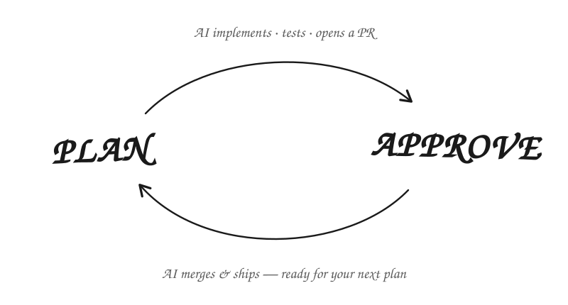
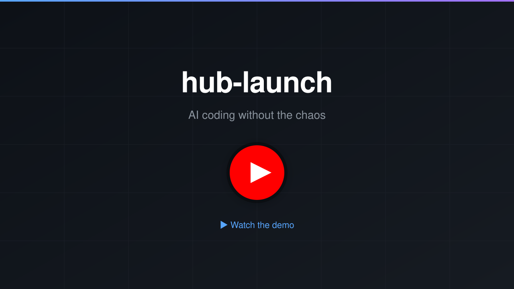

# hub-launch

> **You just plan and approve. AI does the rest.**

<p align="center">
  
</p>

Describe what you want built. HubLaunch drafts an implementation plan with you,
validates it until it's self-contained, then implements it in a clean cloud
sandbox — tests run, PR opened, checked against the plan — and pings you when
it's your turn. Nothing runs on your machine, and nothing touches your current
branch.

## The two commands

Everything happens inside your coding agent (e.g. Claude Code), as slash
commands. There are only two you need.

### 1. Plan

```text
/hula-plan Add password reset support
```

The plan skill asks clarifying questions, studies your codebase, and writes a
detailed implementation plan with acceptance criteria. It then validates the
plan until it stands completely on its own — no hidden chat context — and asks
one question: **ready to launch?**

Say yes, and the rest is automatic: a GitHub issue is created, a cloud sandbox
implements the plan, runs your checks and tests, opens a pull request, and
verifies the result against the plan — posting a merge-safety score so you know
what you're looking at before you look.

Planning something big? One plan is one PR — if a plan is really several PRs'
worth of work, validation says so and offers to split it into a sequence of
right-sized plans, each independently launched, verified, and approved.

### 2. Approve

```text
/hula-approve
```

Review the verified PR and approve it. HubLaunch merges, closes the issue,
cleans up branches and worktrees, and fast-forwards your local `main`. Plan the
next thing.

That's the whole loop. Everything between the two commands happens without you.

## Why it's different

- **Close your laptop** — work runs remotely in a clean sandbox. Nothing to
  install in your project's environment, nothing hogging your machine; the run
  keeps going when you walk away.
- **Real artifacts, not chat** — every task lands as a GitHub issue, branch,
  and pull request in your repo. Your history reads like engineering, not
  transcripts.
- **Verified before you see it** — every PR is checked against its plan's
  acceptance criteria and scored before it reaches you. Approving is an
  informed decision.
- **Interrupted only on purpose** — you're notified when it's your turn — plan
  ready, PR verified — and only then.

## Setup

```bash
npm install -g hub-launch    # once per machine (or: pnpm add -g hub-launch)
cd <your-project>
hula init                    # configures the project AND logs you in
```

`hula init` is the whole onboarding: it walks you through configuration
interactively, installs the slash commands (Agent Skills) into your project
(so `/hula-plan` and friends are available the next time you open your agent),
and — when you're not already authenticated — flows straight into logging you
in with GitHub + HubLaunch. One command, and you're ready to go. Pass
`--skip-login` to configure without authenticating.

`hula login` still exists for re-authenticating on a machine that's already
set up; it auto-runs `hula init` if the project hasn't been initialized yet.
Either command completes onboarding — whichever you run first, you end up fully
set up.

`hula init` is safe to re-run any time — your keys and team settings are
preserved — and you should re-run it after upgrading the CLI.

That's the only time you'll meaningfully touch the `hula` CLI: the rest of it
exists mostly for your agent to call on your behalf.

**Requirements:** Node.js ≥ 18, the GitHub CLI (`gh`) authenticated via
`gh auth login`, and an LLM provider credential for the sandbox agent — bring
your own model: Claude (subscription Pro/Max or an Anthropic API key), OpenAI, or
400+ models via OpenRouter. Pick one during `hula init`. See
[Choosing your LLM provider](./docs/advanced.md#choosing-your-llm-provider) for
details on all three options and how to switch between them.

## Notifications

HubLaunch tells you when it's your turn. Set `updateNotificationUrl` in
`.hublaunch/hublaunch.config.js` to any webhook — a Slack channel works out of
the box, and Telegram or anything else works through a tiny bridge:

```js
export const config = {
  // ...
  updateNotificationUrl: "https://hooks.slack.com/services/T0/B0/secret",
};
```

You'll get a message when the task starts, when the issue is created, and when
the PR is ready (with its verification score). See
[Notifications](./docs/notifications.md) for the payloads, a Telegram setup,
and ideas for automating your side of the loop with `hula info`.

## Other commands

You'll rarely need these — the two commands above cover the normal loop — but
they're there when you want them:

| Command          | What it's for                                                                       |
| ---------------- | ----------------------------------------------------------------------------------- |
| `/hula-fix`      | Fix a gap or bug on the PR branch in an isolated worktree — describe the problem     |
| `/hula-verify`   | Full verification report, criterion by criterion (a summary score is auto-posted)    |
| `/hula-info`     | Peek at a run: live logs, PR diff, initial summary, lessons                          |
| `/hula-launch`   | Launch a plan manually (normally offered automatically after `/hula-plan`)           |
| `/hula-confirm`  | Re-validate a plan you've edited by hand                                             |
| `/hula-upload`   | Sync a plan to `origin/main` (normally automatic during launch)                      |
| `/hula-schedule` | Run or schedule autonomous actions (e.g. a nightly `harden` security audit)          |
| `hula error-watcher` | Manage production Error Watchers — inbound error webhooks that auto-launch fix PRs |
| `/hula-help`     | Interactive onboarding and reference — walks through setup, the workflow, or any command/skill |
| `/hula-create`   | Legacy: create an issue without launching (the modern flow is `/hula-plan` → launch) |

Full details: [Commands Reference](./docs/commands.md) ·
[Advanced Usage](./docs/advanced.md) (launch pipeline internals, resume,
test mode, env forwarding, scheduling).

## Error Watchers

An **Error Watcher** is an inbound webhook: your production app reports an error
to HubLaunch, HubLaunch deduplicates it, and — when the error is new — auto-launches
a fix (a PR, a plan, or a feedback run). Manage watchers from the CLI:

Reporting an error needs **two** pieces, created in different places:

- the **watcher** — the configuration (dedupe window, environments, PR policy,
  agent instructions), managed from the CLI;
- a **project ingest key** — the credential your app presents (`hik_…` plus its
  own signing secret `his_…`), created in the dashboard under **Projects → gear
  icon → Error reporting API keys**.

```bash
# Create a watcher; prints where to mint the ingest key, a .env block, and a
# ready-to-paste signed-request snippet.
hula error-watcher --create --name api-prod

# See what your watchers have been doing, and why each error did or didn't
# launch a fix (omit the id to cover every watcher on the project)
hula error-watcher --events

# List, inspect, patch tuning, or delete
hula error-watcher --list
hula error-watcher --show <watcherId>
hula error-watcher --update <watcherId> --max-fixes-per-day 10
hula error-watcher --update <watcherId> --instructions "Never touch billing/"
hula error-watcher --delete <watcherId>

# Re-print the setup snippet at any time (placeholders only — no secrets, works offline)
hula error-watcher --print-setup
```

Add the printed block to your production environment, filling in the key and
secret from the dashboard:

```bash
HULA_ERROR_WEBHOOK_URL=https://www.hublaunch.site/api/v1/webhooks/error
HULA_INGEST_KEY=hik_…
HULA_INGEST_SECRET=his_…
```

The **key and secret are shown only once** and are never handled by the CLI —
copy them into your deployment's secret store immediately. Every report is signed
with `HMAC-SHA256` over `` `${timestamp}.${body}` `` (the exact payload the printed
snippet produces) and sent as `X-Hula-Api-Key` + `X-Hula-Signature`. Rotate the
secret from the same settings page; the previous one keeps verifying for 24 hours.

Send at least a `key`, `errorName`, or `errorCode` with every report — the dedupe
fingerprint is built from those three fields alone, and a report carrying none of
them shares one bucket with every other such report.

A `409` means the key is valid but the project has no enabled watcher; create one
with `--create`. Requires a hula-server with Error Watcher support; older servers
return a clear "not supported yet" message. Full reference:
[docs/error-watcher.md](./docs/error-watcher.md).

## Multi-repo feature groups

A feature that spans several repositories — say a mobile app plus its backend
API — can be launched as **one correlated group** instead of unrelated jobs you
track by memory. Keep the repos as sibling checkouts under one parent folder,
each already `hula init`'d and `hula login`'d with its own project-scoped API
key:

```
~/code/myapp/
  ├── mobile/   (.git + .hublaunch)
  └── api/      (.git + .hublaunch)
```

Then launch the whole group with one command:

```bash
# Launch the plan in every initialized repo under ~/code/myapp as one group.
# The CLI resolves each repo's newest plan matching the issue name, shows a
# roster, asks once to confirm, then launches each repo with its OWN key plus a
# shared generated groupId (e.g. login-a3f9c1).
hula launch login --folder ~/code/myapp

# Override the auto-resolved plan for one repo (repeatable, path is repo-relative)
hula launch login --folder ~/code/myapp --plan api=.hublaunch/plans/2026-08-10-11:00-login-api.md

# Retry a failed member into the SAME group (idempotent per member)
hula launch login --folder ~/code/myapp --group-id login-a3f9c1

# Combined group status — run inside any member repo, or pass the id explicitly
hula launch --show-group login-a3f9c1

# Stop every member's in-flight task
hula launch login --folder ~/code/myapp --kill
```

| Flag                    | What it does                                                                                       |
| ----------------------- | -------------------------------------------------------------------------------------------------- |
| `--folder <path>`       | Launch the plan in every initialized repo **directly under** `<path>` as one feature group          |
| `--group-id <id>`       | Use/join an explicit group id instead of generating one (`^[A-Za-z0-9_-]{1,64}$`)                   |
| `--plan <repo>=<path>`  | Override the auto-resolved plan for one repo (repeatable; `<path>` is relative to that repo's root)  |
| `--show-group [id]`     | Show combined per-repo status; the id is optional inside a member repo (uses the latest local record)|

> ⚠️ **`hula launch --folder` is NOT the same as `/hula-plan --folder`.** For
> `launch`, `--folder` is the **parent folder that contains your repos**. For
> `/hula-plan`, `--folder` names a **plans subdirectory** inside a single repo.
> The two flags share a name but mean different things — never conflate them.

Each grouped launch is an ordinary single-repo job (billed and gated
individually) that simply carries a shared `groupId`. Grouping and
`--show-group` require a **hula-server with feature-group support**; against an
older server launches still succeed but stay ungrouped and `--show-group`
returns a not-found message.

## Demo

<a href="https://www.youtube.com/watch?v=4-YRVB7mQZ8" target="_blank">
  
</a>

> Some command names in the video predate the current flow — the cycle you'll
> use today is the two-command loop above.

## Dashboard

Track all your active plans, runs, and PRs at
[hublaunch.site/dashboard](https://www.hublaunch.site/dashboard). Visit
[hublaunch.site](https://www.hublaunch.site) for plans and pricing.

## Documentation

| Document                                    | Description                                     |
| ------------------------------------------- | ----------------------------------------------- |
| [Commands Reference](./docs/commands.md)    | Every CLI command with options and examples     |
| [Advanced Usage](./docs/advanced.md)        | Pipeline internals, resume, env forwarding      |
| [Notifications](./docs/notifications.md)    | Slack, Telegram, and automating your responses  |

The full documentation index is at [docs/README.md](./docs/README.md).

## Contributing

1. Fork and create a feature branch
2. Run `pnpm run typecheck`
3. Submit a pull request

## Links

- [HubLaunch Website](https://www.hublaunch.site)
- [Dashboard](https://www.hublaunch.site/dashboard)
- [GitHub Repository](https://github.com/NoStackApp/hub-launch)
- [Issue Tracker](https://github.com/NoStackApp/hub-launch/issues)

## License

MIT — see [LICENSE](./LICENSE) for details.
